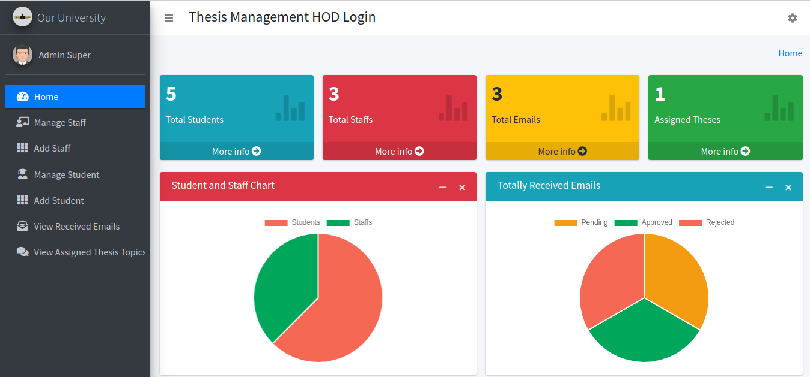
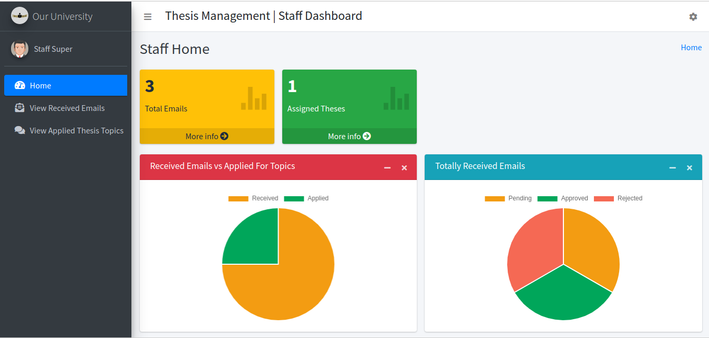
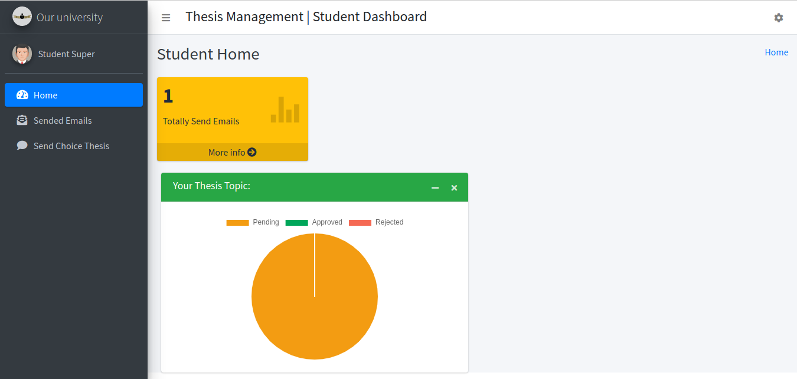

## Thesis Management it's a project used to help students and proffesors maintain thesis topics, grades

Install the requirements:

pip install -r requirements.txt

Run migrations if needed:

- python3 manage.py makemigrations
- python3 manage.py migrate

Finally, run the development server:

- python3 manage.py runserver

The project will be available at **127.0.0.1:8000**.

Login Credentials:
- For admin:
  - email: admin@gmail.com
  - password: admin
- For staff:
  - email: staff@gmail.com
  - password: staff
- For student:
  - email: student@gmail.com
  - password: student

To see how it looks see scrrenshots:
# For Admin Home: 

# For Staff Home: 

# For Student Home: 

